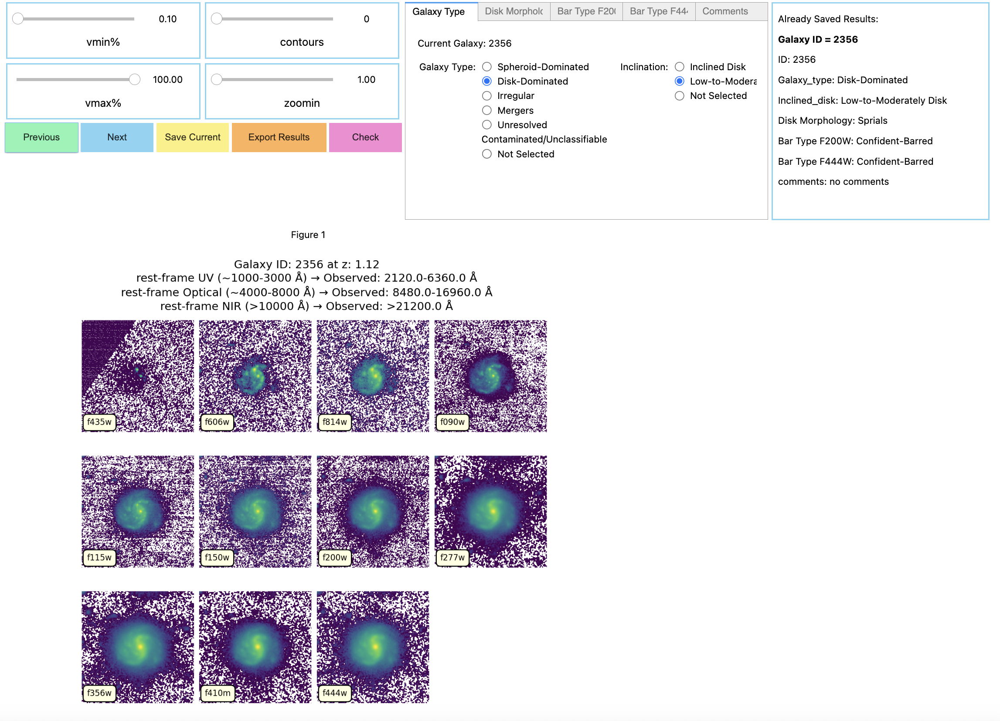

# cwstretch
Example notebook for classifications with stretch

An easy-to-use tool provides an interactive way to do visual classificaitons for astronomical imaging data. It uses Jupyter widgets and Matplotlib to display multi-filter image cutouts, with controls for stretch, zoom, and contour overlays to guide classificaitons.

<div style="
    border: 2px solid #e39611ff; 
    background-color: #cf4606ff; 
    padding: 15px; 
    border-radius: 10px; 
    width: 70%; 
    margin: 20px auto; 
    text-align: center;
    font-family: -apple-system, BlinkMacSystemFont, 'Segoe UI', Roboto, 'Helvetica Neue', Arial;
    font-size: 1.05em;
">
<strong>⚡ Main Strength of This Notebook:</strong><br>
Classifications are guided by the appearance of the images. Finding the optimal stretch — or, in simpler terms, adjusting the contrast — allows classifiers to better identify structures within the images. Allowing users to dynamically adjust the stretch/contrast can significantly improve the accuracy and ease of classification.
</div>

## ✨ Features
- Interactive Image Viewer
    - Load and visualize multi-filter galaxy cutouts for a list of object IDs.
    - Adjustable sliders for:
    - - Image stretch (percentile vmin / vmax)
    - - Contour level density
    - - Zoom factor (central cutouts)

- Classification widgets 
    - - Interactive features to classifiy with in the notebook, for a self-desinged classification scheme, and saved the results to a csv file for later analysis.

- Navigation & Data Management
    - - Buttons for stepping through different galaxy IDs.
    - - Interactive features to classifiy with in the notebook, for a self-desinged classification scheme, and saved the results to a csv file for later analysis.

## 📦 Requirements

Install dependencies:

```bash
pip install numpy matplotlib ipywidgets pandas astropy 
```

Enable interactive matplotlib for Jupyter

Call the following backend on the top of the notebook

```bash
%matplotlib widget
```

To allow it perform properly, you may need to 

```bash
pip install ipywidgets ipympl

#or 

jupyter labextension install @jupyter-widgets/jupyterlab-manager

```

## 🛠 Workflow
Details in the Notebook
#### Step 0 – Setup
- Run %matplotlib widget
- Import dependencies
#### Step 1 – Load Images
- Customize IDs, filters_to_load, and input_dir
- Images load automatically when browsing galaxies
#### Step 2 – Metadata
- Define IDs (list of sources)
- Optionally supply redshift_dict
- Add additional_info_dict if needed
#### Step 3 – Classification Widgets
- Use the existing buttons and widgets or design your own widgets for
- - Adjust stretch, zoom or add contours with sliders
- - Buttons/selection for Classification workflow
- - Navigatiion through the multiple sources
#### Step 4 – Plot cutouts
- Design functions to view your image cutouts
#### Step 5 – Action for each widget
- Design Actions for each widget
#### Step 6 – Run the display and fig.canvas cell to start your your classifications with stretch

## 🖼 Example Screenshot

Here’s what the interactive viewer looks like inside Jupyter:




